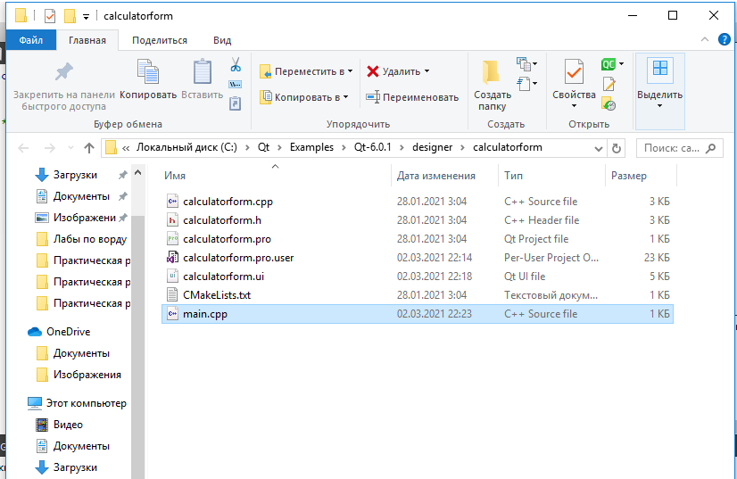

<p align="center">МИНИСТЕРСТВО НАУКИ  И ВЫСШЕГО ОБРАЗОВАНИЯ РОССИЙСКОЙ ФЕДЕРАЦИИ<br>
Федеральное государственное автономное образовательное учреждение высшего образования<br>
"КРЫМСКИЙ ФЕДЕРАЛЬНЫЙ УНИВЕРСИТЕТ им. В. И. ВЕРНАДСКОГО"<br>
ФИЗИКО-ТЕХНИЧЕСКИЙ ИНСТИТУТ<br>
Кафедра компьютерной инженерии и моделирования</p>
<br>
<h3 align="center">Отчёт по лабораторной работе № 4<br> по дисциплине "Программирование"</h3>

<br><br>

<p>студента 1 курса группы ИВТ-б-о-202(2)<br>
Савельевой Динары Шевкетовны<br>
направления подготовки 09.03.01 "Информатика и вычислительная техника"</p>

<br><br>

<table>
<tr><td>Научный руководитель<br> старший преподаватель кафедры<br> компьютерной инженерии и моделирования</td>
<td>(оценка)</td>
<td>Чабанов В.В.</td>
</tr>
</table>
<br><br>

<p align="center">Симферополь, 2021</p>
<hr>

### Цель:

Настроить рабочее окружение, для разработки программного обеспечения при помощи Qt и IDE Qt Creator, а также изучить базовые возможности данного фреймворка.

## Постановка задачи

Настроить рабочее окружение, для разработки программного обеспечения при помощи Qt и IDE Qt Creator, а также изучить базовые возможности данного фреймворка.

## Выполнение работы

#### **Задание 1**

1. Установила с официального сайта последнюю версию фреймворка Qt.

2. Запутстила среду разработки Qt Creator, в разделе "Примеры" перешла в проект "Calculator Form Example".

3. Выбрала версию под "Desktop", после чего нажала на "Редактор".

4. На боковой панели, в разделе "Проекты", в каталоге "Формы" указала на главную форму и заменила текст "Input 1", "Input 2", "Output" на "Ввод 1", "Ввод 2" и "Вывод" (см. Рис. 1).

<p align="center">

</p>
<p align="center"> Рисунок 1 - Замена </p>

#### **Задание 2**

Ответы на вопросы: 

1. Как изменить цветовую схему (оформление) среды? 

   Ответ: Для этого необходимо навести курсором мыши на раздел «Инструменты», а затем перейти в «Параметры». Выбрать вкладку «Среда» для дальнейшей установки (замены) цветовой схемы (см. Рис. 2).

<p align="center">

</p>
<p align="center"> Рисунок 2 - Цветовая схема </p>

2. Как закомментировать/раскомментировать блок кода средствами Qt Creator? Имеется ввиду комбинация клавиш или пункт меню.

   Ответ: Для того чтобы закомментировать/расскомментировать блок кода необходимо для начала его выделить, далее использовать сочетание клавиш Ctrl+ Shift + / (см. Рис. 3).

<p align="center"></p>
<p align="center"> Рисунок 3 - Закомментированный блок </p>

3. Как открыть в проводнике Windows папку с проектом средствами Qt Creator?

   Ответ: В окне «Проекты», необходимо нажать правой кнопкой мыши по необходимому файлу, и выбрать «Показать в проводнике» (см. Рис. 4).

<p align="center">

</p>
<p align="center"> Рисунок 4 - Папка в проводнике </p>   

4. Какое расширение файла-проекта используется Qt Creator? Может быть несколько ответов.

   Ответ: Ключевую роль имеет файл проекта с расширением .pro. Он содержит списки файлов: исходных кодов, файлов ресурсов, файлов локализации, форм, других файлов, которые входят в проект, а также файлов под проектов, если проект состоит из нескольких частей.

5. Как запустить код без отладки?

   Ответ: Для этого необходимо нажать комбинацию клавиш Ctrl + R, или нажать с левой стороны на знак зеленой стрелки (запустить). 

6. Как запустить код в режиме отладки?

   Ответ: Для этого необходимо нажать клавишу F5 или в левой стороне нажать на зеленую стрелку с эмблемой жука (начать отладку запускающего проекта). 

7. Как установить/убрать точку останова (breakpoint)?

   Ответ: С левой стороны нумериции строк необходимо возле необходимой строки нажать на пустое местое. Если появился красный знак, то точка останова установлена. Для того чтобы убрать, необходимо нажать на знак повторно (см. Рис. 5).

<p align="center">

</p>
<p align="center"> Рисунок 5 - Точка останова </p>

#### Задание 3

1. Создайла консольное приложение без Qt.

2. Заменила содержимое файла main.cpp на:

   ```c++
   #include <iostream>
    
   int main() {
       int i;
       double d;
       i = 5;
       d = 5;
       std::cout << i << d;
   }
   ```

3. Переключила режим сборки в режим "Отладка".

4. Установила точки останова на 6, 7, 8 строках, и выполнила программу в режиме отладки (см. Рис. 6).

   <p align="center">

</p>
<p align="center"> Рисунок 6 - Точки останова </p>

5. Ответы на вопросы:

   - Чему равны переменные `i` и `d` в 6 строке;

     Ответ: Переменные равны d - 9,3360..., i - 0 (см. Рис. 7).

     <p align="center">
     
     </p>

   <p align="center"> Рисунок 7 - Переменные в строке 6 </p>

   - Чему равны переменные `i` и `d` в 7 строке;

     Ответ: Переменные равны d - 9,3360..., i - 5 (см. Рис. 8).

     <p align="center">
     
     </p>

   <p align="center"> Рисунок 8 - Переменные в строке 7 </p>

   - Чему равны переменные `i` и `d` в 8 строке;

   Ответ: Переменные равны d - 5, i - 5 (см. Рис. 9).

   <p align="center">
   
   </p>
<p align="center"> Рисунок 9 - Переменные в строке 8 </p>

​	

**Вывод:** За время выполнения работы ознакомилась с инструментарным разработчиком прикладного программного обеспечения, широко используемым для создания графических интерфейсов. Занималась установкой и базовой настройкой программы. Изучила основные функции (точки останова, запуск кода в режиме отладки, запуск кода без отладки). Изучила основное расширение программы (.pro), которое содержит списки: исходных кодов, файлов ресурсов, файлов локализации и т.д.