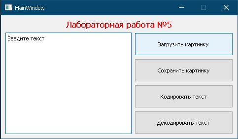
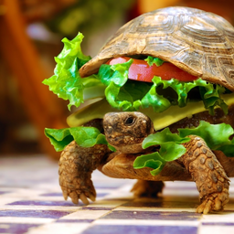

МИНИСТЕРСТВО НАУКИ  И ВЫСШЕГО ОБРАЗОВАНИЯ РОССИЙСКОЙ ФЕДЕРАЦИИ 
Федеральное государственное автономное образовательное учреждение высшего образования 
"КРЫМСКИЙ ФЕДЕРАЛЬНЫЙ УНИВЕРСИТЕТ им. В. И. ВЕРНАДСКОГО" 
ФИЗИКО-ТЕХНИЧЕСКИЙ ИНСТИТУТ 
Кафедра компьютерной инженерии и моделирования

 
<h3 align="center">Отчёт по лабораторной работе № 5  по дисциплине "Программирование"</h3>

  

студентки 1 курса группы ИВТ-б-о-202(2) 
Савельевой Динары Шевкетовны 
направления подготовки 09.03.01 "Информатика и вычислительная техника"

  

<table>
<tr><td>Научный руководитель  старший преподаватель кафедры  компьютерной инженерии и моделирования</td>
<td>(оценка)</td>
<td>Чабанов В.В.</td>
</tr>
</table>
  

Симферополь, 2021

## Цель:

1. Изучить базовые встроенные элементы фреймворка Qt предназначенные для создания приложений с графическим интерфейсом пользователя (GUI);
2. Изучить сигнально-слотовую систему, как один из способов организации взаимодействия компонентов GUI;
3. Получить практический навык работы с побитовыми операторами.

## Постановка задачи

Создать десктоп приложение с GUI позволяющее сохранять текстовую информацию в изображение формата png без видимого изменения исходного изображения. Приложение должно позволять сохранять текст в картинку и извлекать текст из картинки.

## Выполнение работы

Создала окно программы в редакторе интерфейса Qt Designer (см. рис. 1). 

 Рисунок 1 - Окно программы 

Подключила файл с полученным интерфейсом к проекту на C++  и среда Qt Creator автоматически сгенерировала и подключила необходимый код к проекту. Так же с помощью Qt Designer  сгенерировала класс Ui_MainWindow на языке Python. Скопировала созданный код в файл скрипта. Согласно алгоритму описанному в методичке для лабораторной работы, сделала слоты и сигналы для кнопок интерфейса. Написала две функции для перевода массива QByteArray в строку битов и обратно из строки в массив. С помощью этих функций и методов класса QImage написала соответсвующий заданию алгоритм кодирования и декодирования сообщений из картинок. Декодировала сообщение из задания, в сообщении находилась HTML страница со следующим текстом: "Привет. Меня зовут Rick Astley. И я хочу поделиться с вами новым трейлером Grand Theft Auto VI уже сегодня. Жмите на кнопу и приятного просмотра.". Закодировала сообщение в картинку (см. рис. 2)

 Рисунок 2 - Картинка с закодированным текстом

Вывод: Изучила возможности Qt Designer. Получила практический опыт в работе с данным приложением, а так же с переносом интерфейса на разные языки программирования. Изучила принцип работы сигнально слотовой системы Qt. Получила опыт с переводом текстовой информации в байты, биты и обратно.

